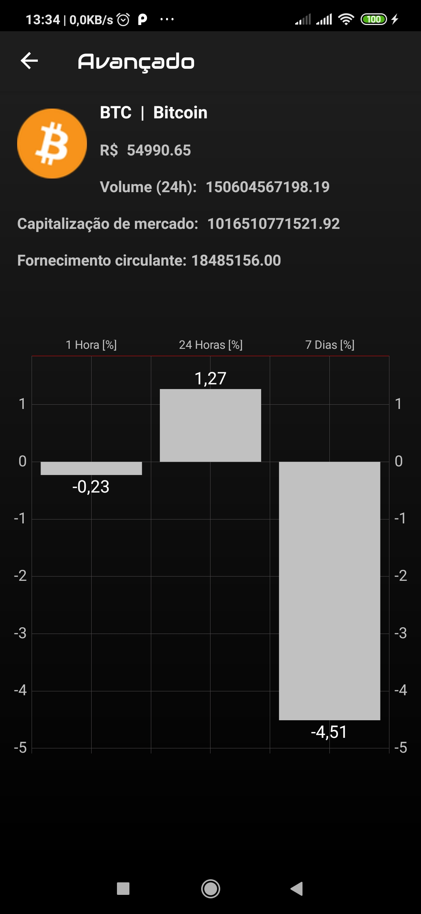

<h1 align="center">
   CryptoView
</h1>

  
  
  

## 🚀 Tecnologias

Esse projeto foi desenvolvido em Kotlin, utilizando os seguintes recursos da linguagem:

- Navigation
- Room
- Data Binding
- RxJava 2
- Retrofit 2

## 💻 Projeto

Projeto teste Zup Innovation.
